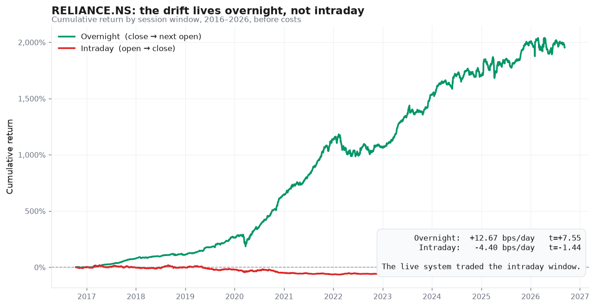
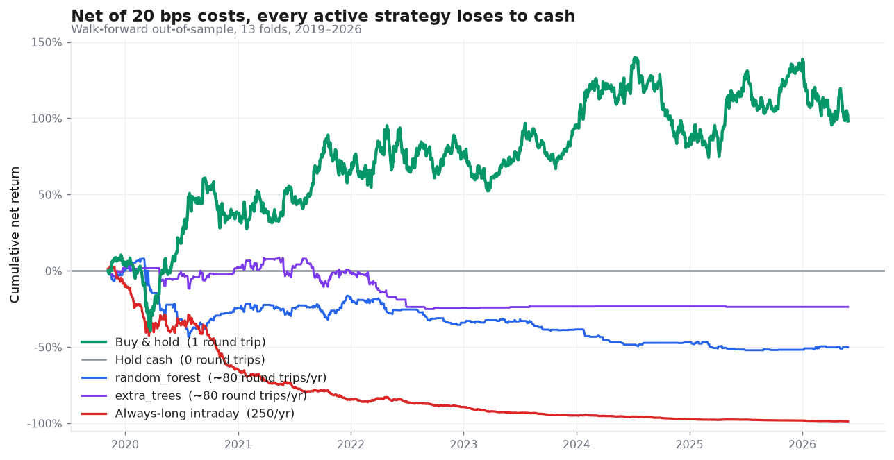
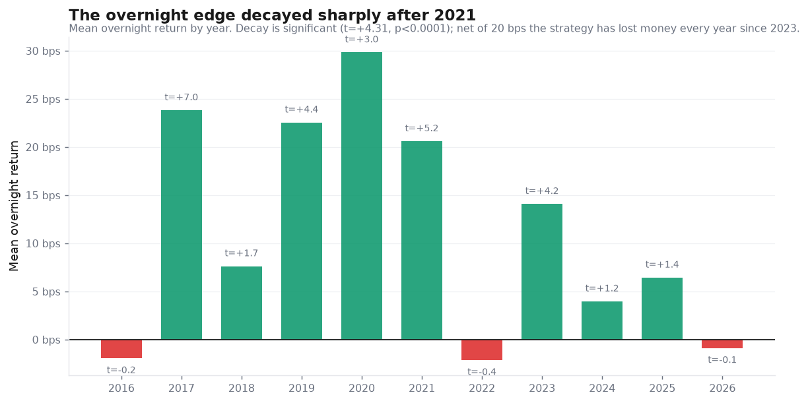
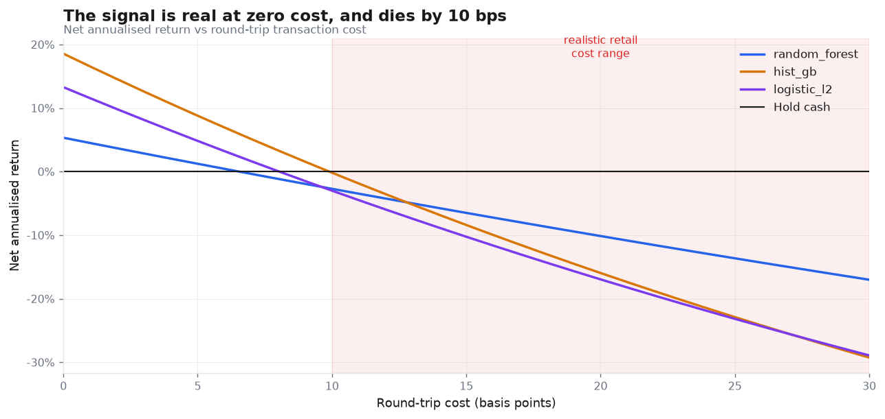

# Why an LLM Stock Predictor Loses to Cash

A rigorous negative result on NSE data.

I built an LLM-driven daily prediction system for RELIANCE.NS, ran it live on
paper for a month, then rebuilt it properly with 10 years of data and 21 market
sources to find out whether it had any edge at all.

It doesn't. This repository documents how I established that, and the two
findings that came out of it.

---

## TL;DR

**1. The drift lives overnight, not intraday.** The system traded the
open-to-close window. That is the one window where the stock does not go up.

| Window | Mean return | t-stat | p |
|---|---|---|---|
| **Overnight** (close → next open) | **+12.67 bps/day** | **+7.55** | **<0.0001** |
| Intraday (open → close) | −4.40 bps/day | −1.44 | 0.15 |

Over 10 years, always-long open-to-close compounds to **−13.2%/yr before costs**.
No amount of feature engineering fixes a window choice.



**2. Transaction costs dominate everything.** A daily round trip at 20 bps costs
**50% a year in fees alone**. The best model found a real but tiny edge of
~5.5 bps/day. Every strategy tested lost to holding cash, and all of them lost
to buy-and-hold.

| Strategy | Net annualised @ 20 bps | Round trips/yr |
|---|---|---|
| **Buy & hold RELIANCE** | **+18.06%** | 1 |
| Hold cash | 0.00% | 0 |
| Best intraday ML model | −10.14% | ~80 |
| Overnight, every night | −20.00% | 250 |
| **Always-long intraday** *(what the original system did)* | **−48.85%** | 250 |



---

## What the models actually achieved

They were not useless. They found statistically real signal — just not enough of
it to pay for the trading.

**Intraday direction** (decision at 09:15 IST, 1,625 out-of-sample days):

| Model | Direction acc | z vs 50% | p | Gross edge |
|---|---|---|---|---|
| random_forest | **53.72%** | 3.00 | **0.0027** | 5.47 bps/day |
| hist_gb | 52.49% | 2.01 | 0.045 | 6.43 bps/day |
| logistic_l2 | 52.12% | 1.71 | 0.087 | 6.65 bps/day |
| mlp | 49.66% | −0.27 | 0.78 | −2.47 bps/day |

53.72% over 1,625 days is real skill (p=0.0027). Breakeven at 20 bps needs
**62%**. The gap is not closeable with better features.

**Overnight direction** (decision at 15:30 IST, full day's OHLCV known) is a much
easier problem — and shows why choosing the right benchmark matters:

| Benchmark | hist_gb result |
|---|---|
| vs 50% (naive) | 63.02%, z=+10.49 — looks spectacular |
| **vs 57.91% base rate** (always-long overnight, free) | **+5.11pp, z=+4.17** — real, but a fifth as impressive |

And it has decayed. Net return by year, best overnight configuration at 20 bps:

| 2020 | 2021 | 2022 | 2023 | 2024 | 2025 | 2026 |
|---|---|---|---|---|---|---|
| +77.6% | +16.2% | +5.2% | **−3.1%** | **−9.9%** | **−0.6%** | **−7.9%** |

The entire headline return is 2020–2021, the COVID volatility regime. Every year
since 2023 is negative.

Reporting only the aggregate would have shown a profitable strategy; the
year-by-year view shows one that stopped working four years ago.



## Does adding more data help? No.

**Zero of 49 features survive Benjamini-Hochberg correction at FDR 5%.**

The feature set spans NIFTY 50, BANKNIFTY, India VIX, the O2C refining complex
(ONGC/IOC/BPCL), large-cap breadth, Brent and WTI crude, gold, USD/INR, DXY,
US 10-year yields, S&P 500, Nasdaq, US VIX, and calendar effects. Strongest
single correlation: ρ = −0.044.

Even the overnight gap — the single most plausible predictor of an intraday move
a priori — is insignificant (ρ=−0.024, p=0.227).

The constraint is cost and market efficiency, not information.



Every model crosses into loss between 6 and 10 bps. Realistic retail round-trip
cost starts at about 10 bps.

---

## Why you can trust these numbers

Most retail algo-trading repos report large returns that come from lookahead
bias. This one is built to make that hard:

- **Structural leakage prevention.** Same-day data enters the panel only through
  an accessor that accepts the opening price and nothing else. Everything else
  passes through a lag helper that shifts before any arithmetic. A feature cannot
  see the future without deliberately bypassing both.
- **Automated leakage audit.** Any feature correlating above |r|=0.30 with the
  label fails the build. Real intraday predictors sit near 0.0–0.1.
- **Walk-forward validation with an embargo gap.** 13 folds, training always
  precedes testing, 5 days dropped at each boundary so rolling windows cannot
  span the split. No random k-fold on time series.
- **In-fold fitting.** Imputers and scalers are fitted on training data only,
  refitted every fold.
- **Multiple-testing correction.** 49 features screened with Benjamini-Hochberg.
- **Costs charged explicitly**, with sensitivity from 0 to 30 bps.
- **Benchmarks that matter.** Not 50% — always-long, always-short, always-flat,
  buy-and-hold, and for overnight, the base rate.

## Repository layout

```
reliance_stocks/
├── 1_fire_morning.py      live: 09:15 prediction pipeline
├── 2_fire_afternoon.py    live: 15:30 settlement + PnL
├── alpha_scraper.py       live: news aggregation, 4-source RSS with dedup
├── sentiment_engine.py    live: LLM client, 4-tier JSON extraction, risk clamp
├── memory_vault.py        SQLite schema, migrations, all reads/writes
├── market_calendar.py     trading-day gate
├── console_setup.py       UTF-8 console bootstrap
├── dashboard.py           Flet monitoring UI
├── trading_firm_memory.db 22 live paper trades — the original evidence
└── research/
    ├── fetch_data.py      21 tickers × 10y → data/
    ├── build_panel.py     leakage-safe panel + audit
    ├── evaluate.py        13-fold walk-forward bake-off
    ├── overnight.py       overnight strategy study
    ├── make_charts.py     renders the README figures from the artefacts
    ├── FINDINGS.md        full results write-up
    └── ORCHESTRATION.md   multi-agent work plan
_archive/                  superseded V1 prototype, kept for history
```

## Reproducing

```bash
pip install -r reliance_stocks/requirements.txt
cd reliance_stocks/research
python fetch_data.py     # ~1 min, 21 tickers × 10y
python build_panel.py    # panel + leakage audit
python evaluate.py       # walk-forward bake-off
python overnight.py      # overnight study
python make_charts.py    # regenerate the README figures
```

## The live system

The original system ran on paper for 22 trading days before the rebuild.
`trading_firm_memory.db` holds that record. It used exactly three inputs: the
day's opening price, one news headline, and a text table of its last five
errors, fed to a local 8B model via LM Studio.

Its measured behaviour, and what the rebuild found, are in
[`research/FINDINGS.md`](reliance_stocks/research/FINDINGS.md). The live
pipeline's own documentation is in
[`reliance_stocks/README.md`](reliance_stocks/README.md).

Bugs found and fixed along the way — each of which had been silently corrupting
results — are worth reading as a catalogue of how this kind of system fails:
a console encoding crash on Windows, a missing trading-day gate that wrote
phantom weekend rows, a date-format corruption that silently dropped rows from
every ordered query, PnL accepted by a function and then discarded, a news
fetcher broken by an upstream schema change that failed over to a neutral
placeholder, and a dashboard whose "live" numbers were `random.gauss`.

## Caveats

- Single stock, single market, daily bars.
- Costs are modelled as a flat round-trip rate. Real slippage varies with size
  and volatility.
- Backtests assume fills at the exact open or close.
- Nothing here is investment advice. It is a demonstration that a plausible
  strategy, tested honestly, has no edge.

## Licence

MIT — see [LICENSE](LICENSE).
